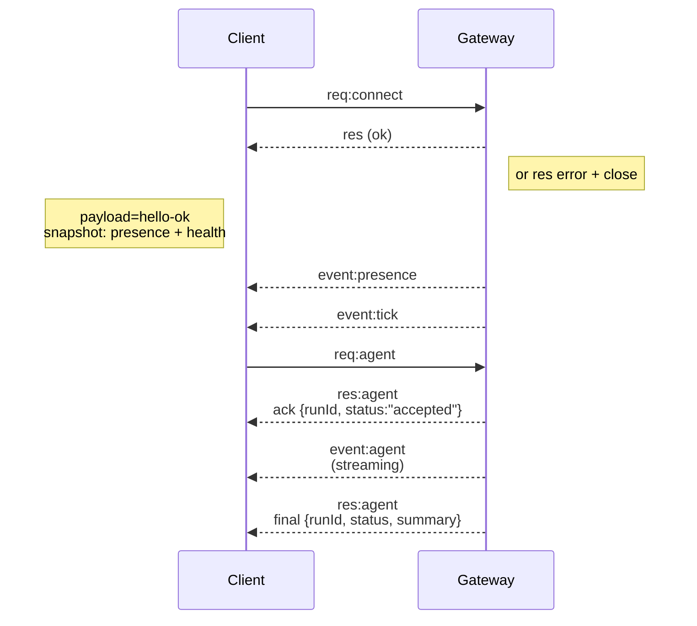

# Gateway 总览:单一控制平面与 WS 协议

> OpenClaw 的架构文档开篇第一句话就是:"A single long-lived **Gateway** owns all messaging surfaces"(`docs/concepts/architecture.md`)。这不是一句口号,而是整个项目的地基决策——WhatsApp 会话、模型调用、工具执行、macOS/CLI/Dashboard 客户端、iOS/Android/headless 节点,全部通过一个常驻进程收敛。本篇从"为什么必须是单一 Gateway"讲起,再拆开它对外暴露的 WebSocket 协议:三种帧类型、强制握手、`hello-ok` 里克制的发现元数据,以及幂等键如何让"发消息""跑一次 agent"这类有副作用的请求可以安全重试。

## 学习目标

- 理解 OpenClaw 选择"单一常驻 Gateway"这个架构决策要解决的三个具体问题:一台宿主机只能有一个 WhatsApp 会话、多个客户端需要看到一致的状态、消息渠道连接需要长期保活。
- 掌握 WS 协议的帧结构:`req`/`res`/`event` 三种帧各自的形状,以及为什么 `connect` 必须是第一帧、非法首帧会被硬关闭连接。
- 理解 `hello-ok.features.methods/events` 是"保守的发现列表",不是把 `src/gateway/server-methods/*.ts` 里每一个可调用方法都吐给客户端——并知道这条设计规则在源码里具体落在哪个文件。
- 通过 `architecture.md` 的连接生命周期时序图,读懂一次典型交互:连接 → 握手快照 → 事件推送 → 发起 agent 请求 → 流式事件 → 两阶段响应。
- 理解幂等键(`idempotencyKey`)在 `send`/`agent` 这类方法上为什么是协议层面的强制字段,而不是一个可选的最佳实践建议。

## 背景与设计动机

设想反过来设计:如果 WhatsApp 连接、Telegram 连接、模型调用、会话状态分别放在不同的进程里,会遇到什么问题?

第一个问题是**账号唯一性**。WhatsApp(通过 Baileys)、Telegram(通过 grammY)这类消息平台的登录会话本质上是"一台设备登录一个账号",如果两个进程同时拿着同一份登录凭证连接,轻则互相挤掉对方的连接,重则触发平台的异常登录检测导致账号被封。`architecture.md` 把这条写进了 Invariants 一节:

> Exactly one Gateway controls a single Baileys session per host.

第二个问题是**多客户端的状态一致性**。CLI、macOS App、Web Dashboard、TUI 可能同时打开,如果每个客户端各自维护一份会话状态、各自决定要不要重连某个渠道,状态漂移几乎不可避免。把状态收敛到一个进程里,客户端退化成"纯粹的展示与输入层",天然解决了这个问题。

第三个问题是**长连接的资源与生命周期管理**。消息渠道连接是需要长期保活的有状态资源(登录态、心跳、重连退避),把它和"某个客户端恰好开着"解耦,才能让 Agent 在没有人盯着 UI 的时候依然正常收发消息、执行定时任务。

`docs/gateway/index.md` 用一句话总结了这个运行时模型:

> One always-on process for routing, control plane, and channel connections.

而且这个"单一进程"不只是承载 WS 协议,它是**单一端口上的多协议复用**:

> Single multiplexed port for: WebSocket control/RPC · HTTP APIs (`/v1/models`, `/v1/embeddings`, `/v1/chat/completions`, `/v1/responses`, `/tools/invoke`) · Plugin HTTP routes · Control UI and hooks

理解了这一点,再看 Gateway 的 WS 协议设计就有了坐标系:它不是"又一个 RPC 框架",而是这唯一一个控制平面对外暴露状态和能力的窗口。

## 核心机制详解

### 谁在连这个 WS:操作者与节点共用一套协议

`docs/concepts/architecture.md` 明确写道,控制面客户端和 Node 设备走的是**同一个** WebSocket 服务器,靠握手时的 `role` 字段区分:

> Control-plane clients (macOS app, CLI, web UI, automations) connect to the Gateway over **WebSocket** ... **Nodes** (macOS/iOS/Android/headless) also connect over **WebSocket**, but declare `role: node` with explicit caps/commands.

`docs/gateway/protocol.md` 给出了协议里全部三种角色:

> Roles: `operator`(control-plane client)、`node`(capability host,camera/screen/canvas/system.run)、`worker`(cloud execution host,走独立的 closed protocol)。

这意味着"要不要多写一套协议给移动端节点"这个问题在设计上直接被消解了——iOS 节点开一条相机快照命令的通道,和 CLI 发一条 `chat.send`,本质上是同一条 WS 连接上的不同权限投影,只是 `role`/`scopes`/`caps` 不同。

### 帧结构:三种帧,一次强制握手

Gateway 的 wire protocol 是纯文本 JSON,`docs/gateway/protocol.md` 给出了三种帧的完整形状:

```text
请求: {type:"req", id, method, params, traceparent?}
响应: {type:"res", id, ok, payload|error}
事件: {type:"event", event, payload, seq?, stateVersion?}
```

握手规则是硬性的:

> First frame **must** be a `connect` request.

`architecture.md` 的 Invariants 一节把违反这条规则的后果写得很直白:

> Handshake is mandatory; any non-JSON or non-connect first frame is a hard close.

`docs/gateway/index.md` 的"Safety guarantees"一节重复了这条规则:"Invalid/non-connect first frames are rejected and closed"。也就是说,这不是一条"建议遵守"的协议约定,而是连接层面的硬门槛——任何客户端实现,第一件事必须是发 `connect`,发别的直接被断开连接,没有宽容期。

握手完成之后,请求和响应通过 `id` 配对,但**响应可能乱序到达**——`protocol.md` 特别提示:

> Started requests complete concurrently, so responses can arrive out of order.

这意味着客户端实现不能假设"我按顺序发的请求,响应也按顺序回来",必须用 `id` 做匹配,而不是用到达顺序做匹配。

### hello-ok:发现元数据,不是方法总表

握手成功后 Gateway 回复 `hello-ok`,其中 `features.methods` / `features.events` 描述了这个 Gateway 实例支持哪些能力。容易望文生义的一点是,把这两个字段当成"这个 Gateway 所有可调用方法的完整清单"。`protocol.md` 专门澄清了这一点:

> `hello-ok.features.methods` is a conservative discovery list built from `src/gateway/server-methods-list.ts` plus loaded plugin/channel method exports — it is not a generated dump of every method, and some methods (for example `push.test`, `web.login.start`, `web.login.wait`, `sessions.usage`) are intentionally excluded from discovery even though they are real, callable methods.

我们去源码里核实了这条说法。`src/gateway/server-methods-list.ts` 里的 `listGatewayMethods()` 确实是把"核心方法目录"和"已加载的 channel 插件方法"合并去重:

```typescript
// src/gateway/server-methods-list.ts
export function listGatewayMethods(): string[] {
  return Array.from(
    new Set([...listCoreAdvertisedGatewayMethodNames(), ...listChannelGatewayMethods()]),
  );
}
```

也就是说,`hello-ok` 里看到的方法列表,是"当前这个 Gateway 实例实际加载了哪些 channel 插件"之后动态拼出来的一份**发现清单**,而不是协议规范本身固化的静态枚举。一个没装 Slack 插件的 Gateway,`hello-ok` 里自然不会出现 Slack 相关的方法名;而像 `push.test`、`web.login.start/wait`、`sessions.usage` 这类真实存在、可以正常调用的方法,却被有意从发现列表里剔除——多半是因为它们要么是特定登录流程的内部步骤,要么用途太窄,放进发现列表反而增加客户端实现的心智负担。这条设计提醒我们:**判断一个方法是否可用,要看协议文档和实际调用是否成功,而不能只看 `hello-ok` 有没有列出它。**

`hello-ok` 里还携带了一份运行时快照和策略上限:

```json
{
  "payload": {
    "type": "hello-ok",
    "protocol": 4,
    "server": { "version": "…", "connId": "…" },
    "features": { "methods": ["…"], "events": ["…"] },
    "snapshot": { "…": "…" },
    "auth": { "role": "operator", "scopes": ["operator.read", "operator.write"] },
    "policy": {
      "maxPayload": 26214400,
      "maxBufferedBytes": 52428800,
      "tickIntervalMs": 15000,
      "attachments": { "maxBytes": 20971520, "maxImageBytes": 6291456 }
    }
  }
}
```

其中 `snapshot` 携带 `presence + health`(`architecture.md`),`policy` 则是客户端必须遵守的硬上限——比如 `docs/gateway/index.md` 提到 `hello-ok` 里的 `snapshot` 还包含 `stateVersion`、`uptimeMs`。这份快照的意义在于:一个新连接上来的客户端不需要再发一轮"我要初始化状态"的请求,握手响应本身就带够了渲染首屏所需的信息。

### 一次典型交互:连接生命周期

`architecture.md` 给出了一份连接生命周期的时序图,这是理解整个协议最直观的入口:



拆开来读:

1. **握手**:客户端发 `connect`,Gateway 要么回 `res(ok)` 附带 `hello-ok` 快照,要么直接 `res error` 并关闭连接——没有第三种结果。
2. **状态推送**:握手成功后,Gateway 立刻开始推送 `presence`(在线状态)和 `tick`(周期性心跳/存活信号)事件,客户端不需要轮询。
3. **发起一次 agent 调用**:客户端发 `req:agent`。
4. **两阶段响应**:`docs/gateway/index.md` 把这个模式总结得很清楚——"Agent runs are two-stage: 1. Immediate accepted ack (`status:"accepted"`) 2. Final completion response (`status:"ok"|"error"`), with streamed `agent` events in between."也就是说,`agent` 方法的第一个 `res` 不是最终结果,只是"请求已被接受、`runId` 是这个"的确认;真正的执行过程通过一连串 `event:agent` 流式事件推送(模型输出、工具调用进展等);等 agent 真正跑完,Gateway 再发第二个 `res:agent`,这次带的是 `final`,携带最终状态和摘要。

这个"ack + 流式事件 + final"三段式模式,本质上是在一个请求/响应协议之上叠加了一层长任务的可观测性——客户端不需要为了"看到中间过程"单独开一条轮询通道,`runId` 把 ack、streaming 事件和 final 结果串成同一条时间线。

### 幂等键:为什么 send/agent 必须带

`architecture.md` 明确指出:

> Idempotency keys are required for side-effecting methods (`send`, `agent`) to safely retry; the server keeps a short-lived dedupe cache.

这解决的是一个所有网络协议都要面对的经典问题:客户端发了 `send`,网络抖了一下没收到响应,这时候客户端到底要不要重发?如果直接重发,而第一次的 `send` 其实已经成功送达对方,那消息就重复发送了两次。

我们在协议 schema 里核实了这条要求的具体落地。`packages/gateway-protocol/src/schema/agent.ts` 里,`SendParamsSchema`(`send` 方法)和 `AgentParamsSchema`(`agent` 方法)都把 `idempotencyKey` 定义为**必填字段**,不是可选项:

```typescript
// packages/gateway-protocol/src/schema/agent.ts
/** Outbound send request shared by channel adapters. */
export const SendParamsSchema = closedObject({
  to: NonEmptyString,
  // ...
  idempotencyKey: NonEmptyString,
});

/** Main agent-run request accepted by the gateway. */
export const AgentParamsSchema = closedObject({
  message: NonEmptyString,
  // ...
  idempotencyKey: NonEmptyString,
});
```

同样带这个必填字段的还有 `PollParamsSchema`(发起投票)和 `MessageActionParamsSchema`(执行 channel 消息动作)——也就是说,这条规则不是针对某一个方法的特例,而是"有副作用的方法"这个类别的通用契约。

服务端如何利用这个字段?`src/gateway/server-shared.ts` 里定义的 `DedupeEntry` 类型给出了答案:

```typescript
// src/gateway/server-shared.ts
// Dedupe entries cache recent request results so repeated gateway calls can
// replay the same success/error payload without re-running the method.
export type DedupeEntry = {
  ts: number;
  ok: boolean;
  requestIdentity?: string;
  payload?: unknown;
  error?: ErrorShape;
};
```

思路是:Gateway 维护一份短生命周期的去重缓存,键是 `idempotencyKey`。第一次请求正常执行并把结果(成功负载或错误)存进缓存;如果同一个 `idempotencyKey` 再次出现——不管是客户端主动重试,还是网络层面的重复投递——Gateway 直接把缓存里的结果原样回放给客户端,而不会真的把消息再发一次、或者把 agent 再跑一遍。这把"网络层面的重试安全性"从客户端的猜测,变成了协议层面的确定性保证:只要 `idempotencyKey` 不变,同一个请求重放多少次,产生的副作用都只有一次。

## 常见问题/易踩坑

- **不要假设 `hello-ok.features.methods` 是完整方法表**。一些真实可调用的方法(`push.test`、`web.login.start/wait`、`sessions.usage`)被有意排除在发现列表之外;判断某个方法是否存在,应该以协议文档(`docs/gateway/protocol.md`)和实际调用结果为准。
- **不要用响应到达顺序来匹配请求**。Gateway 对已开始处理的请求并发执行,响应可能乱序返回,客户端必须靠 `res.id` 匹配对应的 `req.id`。
- **`send`/`agent` 每次业务意图不同的调用要生成新的 `idempotencyKey`,重试同一个意图则复用同一个 key**。如果每次重试都生成新 key,幂等去重完全失效,等价于没做防护;如果不同业务意图复用了同一个 key,则会导致后一条消息被误判成前一条的重放而被吞掉。

## 小结

单一常驻 Gateway 解决的是账号唯一性、多客户端一致性、长连接生命周期这三个具体问题;它对外暴露的 WS 协议用 `req`/`res`/`event` 三种帧、强制的 `connect` 首帧握手、克制的 `hello-ok` 发现元数据,把"操作者客户端"和"Node 设备"统一到同一套连接模型里;`send`/`agent` 这类有副作用的方法则用协议层面强制的 `idempotencyKey` 换来了安全重试的能力。但这套协议里还有一个关键前提没有展开:**一个 WS 连接凭什么被信任、`connect.challenge` 的签名验证具体在防什么**——这正是下一篇《Pairing 与设备信任模型》要拆解的内容。
