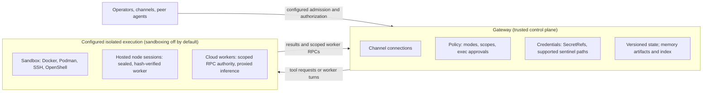

# 安全模型与信任边界

> OpenClaw 官方文档在把自己和同类项目做架构对比时,把整套安全论证浓缩成一句话:"a trusted gateway, untrusted execution, deterministic policy, and versioned state"——一个可信的网关,不可信的执行,确定性的策略,以及版本化的状态。这句话拆开来看,每个词都在划一条边界:Gateway 本身(路由、配置、凭据、控制面协议)被当作可信的控制平面;但它调度出去执行的动作——shell 命令、文件读写、插件调用——从设计上就被当作**不可信**的,靠写死在代码里的确定性策略去约束,而不是指望模型自己判断"这个动作安不安全"。本篇要把这句架构论断拆开讲透,再落到 `SECURITY.md` 给出的具体信任模型条款上。

## 学习目标

- 理解"可信网关、不可信执行、确定性策略"这句架构论断的完整含义,以及它要回应的评估问题:信任边界到底划在哪里,策略是写在代码里还是写在系统提示词里当作请求。
- 理解 `SECURITY.md` 定义的"单网关 = 单信任域"模型:一个 Gateway 内的所有认证调用者都被当作同一信任等级的操作者,这不是疏漏,而是明确声明的设计前提。
- 理解入站消息、模型输出、插件代码在这套信任模型里分别处于什么位置——"agent/model 不是可信主体"这条基线具体如何落地成配对(pairing)、允许列表(allowlist)和作用域(scope)。
- 区分 `docs/gateway/permission-modes.md`(会话级文件系统边界与提权审核者)和 `docs/tools/permission-modes.md`(宿主 exec 的批准模式)——两份同名文档分别管辖的是完全不同的两层控制。
- 能用"七个可测试属性"这套框架去评估任何一个 agent 运行时的企业级安全姿态,而不是被一张功能对比表带偏。

## 背景与设计动机

`docs/start/why-openclaw.md` 开篇就点出了一个容易被忽略的事实:仅仅罗列 channels、tools、memory、skills、scheduling 这些功能清单,并不能说明一个 agent 运行时的安全模型——

> "A feature table does not establish the security model. The main distinctions are **where the trust boundary lies** and **whether policy is enforced in code or requested in the system prompt**."
> —— `docs/start/why-openclaw.md`

这句话背后有一个具体的反面案例。文档里反复对照的 Hermes Agent,其 `SECURITY.md` 有一句被 OpenClaw 引用的表态:

> "The only security boundary against an adversarial LLM is the operating system."
> —— Hermes Agent `SECURITY.md`,转引自 `docs/start/why-openclaw.md`

这句话意味着:在 Hermes 的模型里,agent 循环、渠道连接、凭据和 shell 全都挤在同一个 OS 用户下的同一个信任信封里,把整个应用包进一层 VM 只是把它作为一个整体与宿主机隔离,并不能把这些组件彼此分开。OpenClaw 想做的是另一件事——把 Gateway(拥有渠道连接、配置、凭据、控制面协议)和它调度出去的执行(可以是沙箱、可以是 node,可以是一次性云端 worker)分开:

这里有一个必须提前说清楚的限定:**这种分离是配置出来的,不是默认状态**。`why-openclaw.md` 用加粗字体反复强调这一点:

> "**Sandboxing is off by default.** Out of the box, OpenClaw is a personal assistant for one trusted operator, and exec runs on the gateway host without prompts. The enterprise posture requires explicit configuration, verifiable with two commands: `openclaw sandbox explain` prints the effective execution posture, and `openclaw security audit` flags drift with stable check IDs you can alarm on."
> —— `docs/start/why-openclaw.md`

也就是说,"可信网关、不可信执行"描述的是 OpenClaw **能够**支撑的架构上限,而不是它开箱即用的姿态——这一点会在下一篇讲沙箱时反复用到,因为很多人第一次读到"OpenClaw 有沙箱"就默认它是默认开启的,而文档在这一点上非常诚实。

## 核心机制详解

### 七个可测试属性:企业级评估到底在问什么

`why-openclaw.md` 没有停留在"我们比对方安全"这种空洞断言上,而是先给出一套可测试的评估框架——"一个企业级 harness 必须证明什么":

> "1. **Separated trust boundary.** Execution moves into a sandbox, a node, or a throwaway cloud machine without standing Gateway credentials; scoped worker credentials have a separate lifecycle.
> 2. **Policy is code.** Denial is structural, not a request the model is asked to honor; approval paths fail closed.
> 3. **Authenticated access, bounded roles.** Inbound access is default-deny and authenticated; people hold bounded roles; the vendor states which boundaries are security and which are convenience.
> 4. **Secrets have owners.** Isolatable credential failures degrade their owners; ingress-auth and invalid-configuration failures stop startup.
> 5. **Versioned state, guarded upgrades.** State is schema-versioned with owned migrations; upgrades are guarded and delivered through release channels.
> 6. **Recorded provenance.** Memory, audit, and delivery use recorded facts, explicit retention policies, and documented deletion limits.
> 7. **Independent stewardship.** The license has no separate enterprise edition; releases are signed by an accountable identity; the security record is public."
> —— `docs/start/why-openclaw.md`

这七条里,第 1、2、3 条正是本章要展开的内容:第 1 条对应本篇讲的信任边界划分和下一篇讲的沙箱/node/云端 worker;第 2 条对应"策略是代码"这条主线,贯穿权限模式、工具策略和 exec approvals;第 3 条对应本篇后半段讲的入站认证和角色。第 4、5、6 条留给本章第三篇(secrets 与 audit),第 7 条是治理层面的话题,不在本章展开。

值得注意的是第 2 条的措辞——"denial is structural, not a request the model is asked to honor"。这句话是整章的方法论基石:凡是"策略"这个词出现的地方,读者都应该反射性地追问"这条策略是靠代码里的硬性判断实现的,还是靠系统提示词里一句'请不要做危险的事'实现的"。OpenClaw 的设计选择是前者,`why-openclaw.md` 的 Policy as code 一节把这一点讲得更具体:

> "Deterministic enforcement is not unique to OpenClaw — Claude Code, Codex, and Goose all gate approvals in code. Structural tool gating in a multi-channel assistant, rather than a terminal, is rarer: permission modes shape which tools exist at all. For OpenClaw-managed tools, a `read-only` session omits `edit`, `write`, and `apply_patch`, and its exec tool resolves to a deny policy at the call boundary."
> —— `docs/start/why-openclaw.md`

这里的关键区分是:确定性执行本身不是 OpenClaw 独有的创新(Claude Code、Codex、Goose 都在代码里做审批门控),OpenClaw 的差异化在于把这套"结构性工具门控"从一个终端场景扩展到了一个多渠道助手场景——`read-only` 模式下 `edit`/`write`/`apply_patch` 这些工具**根本不存在**于模型可见的工具列表里,而不是"工具存在但被提示词劝阻不要调用"。

### Gateway 拥有什么,执行边界在哪里

`why-openclaw.md` 对 Gateway 的职责边界给出了一句精确定义:

> "The Gateway owns channel connections, config, credentials, and the control-plane API. It binds to loopback by default and refuses non-loopback binds without a working auth path."
> —— `docs/start/why-openclaw.md`

而执行侧的路由逻辑是:

> "`tools.exec.host` resolves to the gateway host, a sandbox, or a paired node. While a sandbox runtime is active, per-call escapes to the host are rejected. An explicit `host=sandbox` with no runtime configured fails instead of silently running on the host."
> —— `docs/start/why-openclaw.md`

这句话里"fails instead of silently running on the host"是一个值得反复咀嚼的设计取向:当运维者显式要求 `host=sandbox` 但沙箱运行时并没有配置好时,OpenClaw 选择让这次调用直接失败,而不是悄悄退化成在宿主机上直接跑——静默降级到更宽松的执行环境,是很多安全事故的经典成因,这里用"拒绝而非降级"堵死了这条路。

跨机器执行的场景走得更远。一个被配对的 node 收到的不是明文凭据,而是一个"密封的 worker 产物":

> "A paired node that hosts sessions receives a sealed worker artifact. OpenClaw verifies that artifact's content hash at three points: download, manifest, and every reuse. The node installs no packages and runs no lifecycle scripts."
> —— `docs/start/why-openclaw.md`

云端 worker 这条路径则是"标准 Gateway 凭据完全不上车"的极致版本:

> "That machine connects back to the Gateway with a closed, dispatcher-enforced RPC method allowlist. It gets per-dispatch minted credentials, stored hashed at rest with a ten-minute TTL, and holds no standing model, GitHub, or cloud credential. Inference is proxied through the Gateway."
> —— `docs/start/why-openclaw.md`

三种执行路径(沙箱、node、云端 worker)共享同一个设计原则:执行环境拿到的授权范围是**按次铸造、按调用限定、可验证来源**的,而不是把 Gateway 自己手里的那把"万能钥匙"原样复制一份带出去。

### 入站消息与身份:agent 不是可信主体

前几篇课程已经建立了"入站消息是不可信输入"这个第一手印象,这里把它钉死在 `SECURITY.md` 的具体条款上。文档专门有一节叫 Agent and Model Assumptions:

> "The model/agent is **not** a trusted principal. Assume prompt/content injection can manipulate behavior.
> Security boundaries come from host/config trust, auth, tool policy, sandboxing, and exec approvals.
> Prompt injection by itself is not a vulnerability report unless it crosses one of those boundaries."
> —— `SECURITY.md`

这段话有一个容易被误读的地方:"prompt injection by itself is not a vulnerability" 不是说 OpenClaw 觉得 prompt injection 不重要,而是说——按这套信任模型的定义,prompt injection 造成危害的**充分条件**是它必须先穿透一层文档承认的边界(auth、tool policy、sandbox、exec approvals 之一),否则就只是"模型说了一句被污染的话,但什么都没发生"。这和上一篇 Hermes 课程里"批准门是启发式、不是边界"的表述遥相呼应,但 OpenClaw 走得更远——它明确列出了**哪些东西才算边界**,而不只是声明"OS 是唯一边界"。

`SECURITY.md` 紧接着给出了一条实操建议,呼应"模型越弱越容易被注入"这个直觉:

> "Weak model tiers are generally easier to prompt-inject. For tool-enabled or hook-driven agents, prefer strong modern model tiers and strict tool policy (for example `tools.profile: "messaging"` or stricter), plus sandboxing where possible."
> —— `SECURITY.md`

在信任触发(trigger authorization)和上下文可见性(context visibility)之间,文档也做了一条精细区分,这条区分决定了"谁能让 agent 做事"和"agent 能看到什么补充上下文"是两件独立的事:

> "OpenClaw distinguishes:
> - **Trigger authorization**: who can trigger the agent (`dmPolicy`, `groupPolicy`, allowlists, mention gates)
> - **Context visibility**: what supplemental context is provided to the model (reply body, quoted text, thread history, forwarded metadata)"
> —— `SECURITY.md`

文档坦承当前版本里这两者并不总是对齐——allowlist 主要管触发和 owner 类命令访问,但不保证跨每个渠道的上下文都被同等程度地脱敏,某些渠道已经按发送者 allowlist 过滤补充上下文,另一些渠道仍然原样传递。这不是掩盖问题,而是把"当前实现的不均匀"明确写进了安全文档,留作后续加固路线图。

### 单网关 = 单信任域:不是多租户系统

`SECURITY.md` 用一整节 Operator Trust Model 把这条边界画得非常直白:

> "OpenClaw does **not** model one gateway as a multi-tenant, adversarial user boundary.
> - Authenticated Gateway callers are treated as trusted operators for that gateway instance.
> - ...
> - If one operator can view data from another operator on the same gateway, that is expected in this trust model."
> —— `SECURITY.md`

这意味着"一个 Gateway 内部有权限差异"这件事,在报告安全问题时**默认不成立**——除非能证明存在认证、策略、allowlist、审批或沙箱层面的绕过。文档还专门警告了一种容易被误报的场景:插件安装之后的行为不算漏洞——

> "Plugins/extensions are part of OpenClaw's trusted computing base for a gateway.
> - Installing or enabling a plugin grants it the same trust level as local code running on that gateway host.
> - Plugin behavior such as reading env/files or running host commands is expected inside this trust boundary."
> —— `SECURITY.md`

以及一条同样容易被误解的规则:工作区记忆文件(`MEMORY.md`、`memory/*.md`)被当作可信的本地运维状态,不是隔离边界——

> "If someone can edit workspace memory files, they already crossed the trusted operator boundary.
> ...
> Example report pattern considered out of scope: 'attacker writes malicious content into `memory/*.md`, then `memory_search` returns it.'"
> —— `SECURITY.md`

这条规则的潜台词是:能写工作区文件的人已经是可信操作者了,再去论证"这个可信操作者写的内容后来被 agent 读到"没有意义——真正的边界在"谁能写这个文件"这一步,而不是"文件内容后来被怎么用"。

如果需要真正意义上的多租户隔离,`SECURITY.md` 给出的答案不是在单个 Gateway 内部加权限层,而是物理拆分:

> "Recommended mode: one user per machine/host (or VPS), one gateway for that user, and one or more agents inside that gateway.
> If multiple users need OpenClaw, use one VPS (or host/OS user boundary) per user."
> —— `SECURITY.md`

`why-openclaw.md` 补充了这条原则在企业场景下的落地方式——按租户拆 Gateway cell,而不是在共享 Gateway 内部做隔离:

> "Our security docs define the scope: one gateway is one trust domain. Roles organize collaboration between people who already trust each other. For tenancy, you run one gateway per tenant; `openclaw fleet` automates this with one hardened container cell per tenant with its own state, credentials, and network (currently experimental)."
> —— `docs/start/why-openclaw.md`

### 两份"权限模式"文档,管的是两层完全不同的东西

OpenClaw 文档里有两份标题几乎相同的文件——`docs/gateway/permission-modes.md`(标题"Session permission modes")和 `docs/tools/permission-modes.md`(标题"Permission modes")。第一次读容易把它们当成同一件事的两份拷贝,但它们各自管辖的是完全不同的控制维度。

`docs/gateway/permission-modes.md` 管的是**一个会话的文件系统边界和 exec 提权审核者**:

| Mode | Filesystem access | Exec escalation reviewer |
| --- | --- | --- |
| `read-only` | Reads under `sessionRoot`; managed mutation tools omitted | None; exec is denied |
| `guarded` | Reads and writes under `sessionRoot` | A human after the allowlist fast path |
| `workspace` | Reads and writes under `sessionRoot` | LLM review, with human fallback |
| `full` | Unrestricted filesystem access | None |

这张表的第二列"Exec escalation reviewer"是这份文档最容易被忽略的部分——`workspace` 模式下,决定一个未命中 allowlist 的命令能不能跑的第一道审核者不是人,而是**另一个 LLM**("LLM review, with human fallback"),只有当 LLM 审核者也无法安全判断时才会退回人工。这是"策略是代码"这条主线里一个微妙的例外:审核逻辑本身用代码钉死了触发条件和退回路径,但审核的**判断**这一步交给了模型——下一篇讲 exec approvals 时会看到 `tools.exec.mode: "auto"` 如何把这条 LLM 审核路径接到宿主 exec 的批准链路上。

而 `docs/tools/permission-modes.md` 管的是**宿主 exec 本身怎么被批准**,和会话文件系统边界完全正交:

| Mode | security / ask | Behavior |
| --- | --- | --- |
| `deny` | `deny` / `off` | Block host exec entirely. |
| `allowlist` | `allowlist` / `off` | Run only allowlisted commands; silently deny misses. |
| `ask` | `allowlist` / `on-miss` | Run allowlist matches; ask a human on misses. |
| `auto` | `allowlist` / `on-miss` | Run allowlist matches; send misses through auto-review before falling back to human approval. |
| `full` | `full` / `off` | Run host exec without prompts. |

文档专门用一条提示把两者的独立性钉死:

> "Permission mode is separate from `tools.exec.host=auto`. `tools.exec.host` chooses **where** a command runs. `tools.exec.mode` chooses **how** host exec is approved."
> —— `docs/tools/permission-modes.md`

也就是说,一个会话可以是 `permissionMode: "guarded"`(文件系统边界收紧、exec 提权要走人工审核),同时它的宿主 exec 批准策略是 `tools.exec.mode: "full"`(宿主 exec 本身完全不设批准门)——这两个配置项分别回答"这个会话能碰到哪些文件"和"这个会话的 shell 命令要不要经过批准",互不隐含对方。下一篇会把这两层再叠加上"沙箱"和"提权(elevated)"两个维度,变成一个四层的立体模型。

## 常见问题/易踩坑

- **不要把"OpenClaw 支持沙箱"误读成"OpenClaw 默认沙箱化"**——`agents.defaults.sandbox.mode` 默认是 `off`,`tools.exec.host` 默认是 `auto`(有沙箱用沙箱,没有就用 gateway),这意味着开箱即用的 OpenClaw 是"单一可信操作者、exec 直接跑在宿主机上不设批准门"的个人助理姿态。企业级姿态需要显式配置,并且可以用 `openclaw sandbox explain` 和 `openclaw security audit` 两条命令验证配置是否生效、是否漂移。
- **不要把"单网关"里的多个认证调用者当作多租户系统**——同一 Gateway 内,一个操作者能看到另一个操作者的数据,在这套信任模型下是"预期行为",不是需要报告的漏洞。真正需要租户隔离时,答案是拆分成多个 Gateway 实例(或用还在实验阶段的 `openclaw fleet`),而不是在单个 Gateway 内部找权限漏洞。
- **不要把"插件安装后的行为"当作攻击面来报告**——插件在 OpenClaw 的信任模型里等同于宿主机上的本地代码,安装或启用它本身就等于把同等信任级别授予了它。真正值得关注的是"插件是否绕过了认证/策略/allowlist/沙箱边界",而不是"一个被信任安装的插件做了什么"。
- **两份"权限模式"文档不要混着读**——`docs/gateway/permission-modes.md` 管会话的文件系统边界和提权审核者,`docs/tools/permission-modes.md` 管宿主 exec 本身的批准策略。二者可以任意组合,理解上要分开看。

## 小结

这一篇把"可信网关、不可信执行、确定性策略"这句架构论断落到了具体条款上:Gateway 拥有渠道连接、配置、凭据和控制面协议,是这套架构里被信任的部分;它调度出去的执行——无论是本地沙箱、配对的 node,还是一次性的云端 worker——被当作不可信的,靠按次铸造、按调用限定的授权去约束,而不是指望模型自己守规矩。`SECURITY.md` 把"单网关 = 单信任域"钉得很死:同一 Gateway 内的认证调用者互相之间没有权限隔离,这是设计前提而不是漏洞;agent/model 本身从不被当作可信主体,prompt injection 只有在穿透了认证、策略、沙箱或审批这些实打实的边界之后才算真正造成危害。而"策略是代码"这条主线,具体展开成三层可以叠加组合的控制:沙箱决定工具跑在哪里,工具策略决定哪些工具存在,提权(elevated)是专门给 exec 开的逃生舱——下一篇就要把这三层控制、以及 exec approvals 的具体审批链路和 Crabbox 这个独立沙箱项目的定位,一次讲透。
